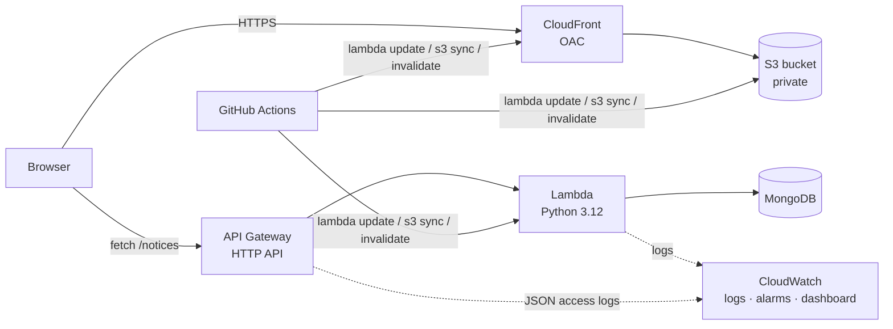

# Notice Board – Full-Stack AWS Deployment

**Student:** Rohan Krishna Bandla · **Cohort:** Full-Stack AWS, 28-Sep-2026 · **Project:** 02 – Notice Board

A React notice board backed by a Python Lambda and MongoDB. It's deployed to AWS with **Terraform**, kept up to date by **GitHub Actions**, and served over HTTPS through **CloudFront**.

**Live app:** `https://<cloudfront-domain>.cloudfront.net` *(replace after deploying)*

## Architecture



| Route | Purpose |
|---|---|
| `GET /notices` | List notices |
| `POST /notices` | Create `{ "title", "content" }` |
| `GET /notices/{id}` | One notice |
| `PUT /notices/{id}` | Update |
| `DELETE /notices/{id}` | Delete |

Every resource is prefixed `student-rohan-krishna-bandla-notice-board-` and tagged `workshop=full-stack`, `autodelete=true` and `date=28-Sep-2026`.

## Project layout

```
backend/lambda_function.py   Lambda handler (MongoDB CRUD)
backend/requirements.txt     pymongo
build.py                     packages backend/lambda.zip (Linux wheels, works from Windows too)
frontend/                    React + Vite, API URL injected with VITE_API_URL
terraform/                   S3, CloudFront + OAC, Lambda, API Gateway, CloudWatch
.github/workflows/deploy.yml CI/CD: push to main -> deploy
```

## Tier 1 – Terraform deployment

```bash
python build.py                                  # -> backend/lambda.zip
cd terraform
cp terraform.tfvars.example terraform.tfvars     # fill mongo_uri (+ lambda_role_arn on the class account)
terraform init
terraform apply                                  # enable_cloudfront = false -> public S3 website
cd ../frontend
npm install
VITE_API_URL=<api_gateway_url output> npm run build
aws s3 sync dist/ s3://<s3_bucket_name output>/ --delete
```

Open the `website_url` output. Notices can be posted and deleted.

## Tier 2 – GitHub Actions

`.github/workflows/deploy.yml` runs on every push to `main`. It:

1. builds `lambda.zip` and runs `aws lambda update-function-code`
2. builds React with `VITE_API_URL` and runs `aws s3 sync`
3. invalidates the CloudFront cache

Repository secrets: `AWS_ACCESS_KEY_ID`, `AWS_SECRET_ACCESS_KEY`, `AWS_REGION`, `LAMBDA_FUNCTION_NAME`, `S3_BUCKET`, `VITE_API_URL`, `CF_DISTRIBUTION_ID`.

## Tier 3 – CloudFront + private S3

Set `enable_cloudfront = true` in `terraform.tfvars` and run `terraform apply`. Terraform then:

- creates an Origin Access Control and a CloudFront distribution (`redirect-to-https`)
- turns on **Block all public access** and removes static website hosting
- replaces the bucket policy so only this distribution can read it

The S3 website URL now returns 403, and the app is only reachable at `https://<id>.cloudfront.net`. The workflow invalidates `/*` after each deploy.

## Tier 4 – Observability (optional)

| Item | Resource |
|---|---|
| 14-day log retention | `/aws/lambda/<function>` and `/aws/apigateway/<name>-access` |
| JSON access logs | API Gateway `$default` stage `access_log_settings` |
| Alarms (5-min windows) | `…-lambda-errors` (Errors > 0) and `…-apigw-5xx` (5xx > 0) |
| Dashboard | `student-rohan-krishna-bandla-notice-board`: Lambda, API Gateway, CloudFront |
| Saved Logs Insights queries | `…/lambda-errors` and `…/api-requests-by-status` |

How to force the alarms into `ALARM`:

```bash
# API Gateway 5xx: an invalid id makes the Lambda return 500
curl https://<api-id>.execute-api.us-east-1.amazonaws.com/notices/not-a-valid-id

# Lambda Errors: invoke with a malformed event (unhandled exception)
aws lambda invoke --function-name <function> --cli-binary-format raw-in-base64-out \
  --payload '"oops"' out.json
```

## Notes and fixes compared to the reference guide

- **API routes:** the reference Terraform used `ANY /{proxy+}`. With that route, Lambda receives `pathParameters.proxy` instead of `pathParameters.id`, so `DELETE /notices/{id}` returned 400. This project defines the five explicit routes instead.
- **Environment variable:** the reference Terraform passed `PG_*` (PostgreSQL) variables, but the handler reads `MONGO_URI`. Terraform now passes `MONGO_URI`.
- **Class AWS account:** students can't create IAM roles, so `lambda_role_arn` accepts the shared `quicklabs-…-lambda-exec` role.
- **Cross-platform packaging:** `build.py` downloads Linux wheels, so a zip built on Windows still runs on Lambda.

## Screenshots

| | |
|---|---|
| App on CloudFront (HTTPS) | `screenshots/app-cloudfront.png` |
| S3 website URL returns 403 (bucket private) | `screenshots/s3-private-403.png` |
| GitHub Actions run (green) | `screenshots/github-actions.png` |
| CloudWatch dashboard / alarms | `screenshots/dashboard.png`, `screenshots/alarms.png` |

## Clean up

```bash
cd terraform && terraform destroy
```
